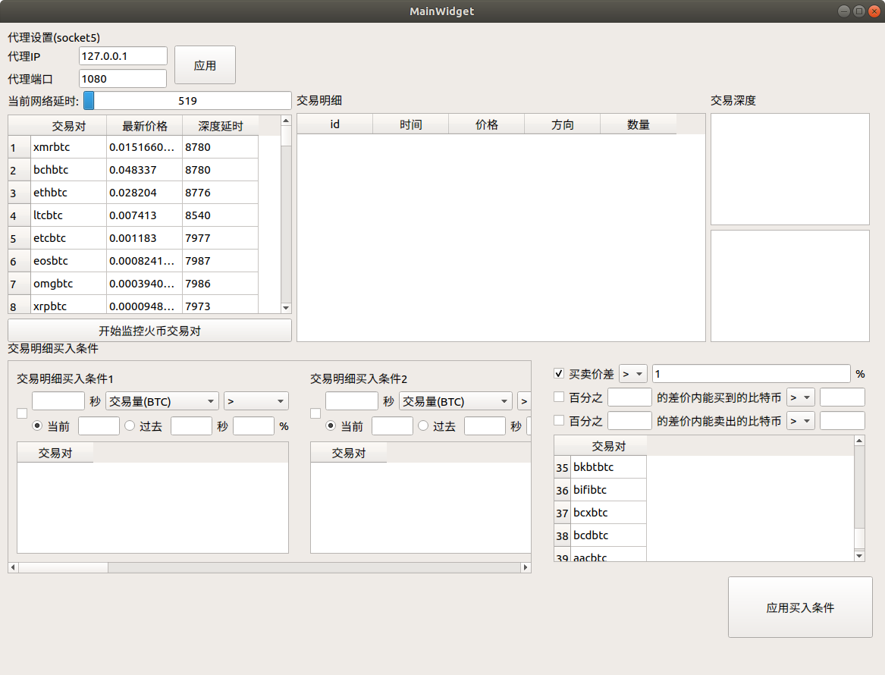

# CoinMarketWatcher

通过监控各种数字货币市场数据的软件
我的联系方式:lihn1011@163.com
## 目前进度
- 能够监控历史交易数据，并在界面上显示
- 能够监控实时价格，并在界面上显示
- 能够非实时监控交易深度，并在界面上显示
- 能够将一段时间交易量作为买入条件
- 能够将一段时间交易量同另外一段时间交易量的比例作为买入条件
- 能够将一段时间交易次数作为买入条件
- 能够将一段时间交一次数同另外一段时间交易次数的比例作为买入条件
- 能够同时设置10个基于交易明细的买入条件
- 能够将一段时间内的买卖交易量比作为买入条件
- 能够将一段时间内的买卖交易量比同另外一段时间的买卖交易量比的比例作为买入条件
- 能够将一段时间的买卖交易次数比作为买入条件
- 能够将一段时间内的买卖交易次数比同另外一段时间的买卖交易次数比作为买入条件
- 能够在界面上进行代理设置
- 能够将买卖价格差作为买入条件
- 能够将百分比内能买到的btc数量作为买入条件
- 能够模拟买入
- 优化短视内存占用
- 增加模拟卖盘，优化短视策略
- 为卖盘增加止赢止损策略

## 正在进行的计划
- 实现对账户的配置

## 未来计划
- 能够将数据保存到数据库以备用
- 能够对卖出条件进行筛选
- 实现对账户的配置
- 能够模拟卖出
- 实现实盘买入功能
- 实现实盘卖出功能
- 实现对账户的监控
- 实现对交易历史的监控
- 实现对套利历史的分析

## 已知bug
- websocket超时时，无法直接重连，因为头几条消息的延时时间非常长，无法手动进行超时判断，而我又担心加了代理后，有时连接断开无法被发现

##日志
- 2018-12-04 从凌晨1点到11点，长时间测试，没有奔溃了，稳定的一笔！
- 2018-12-04 22点开始测试，模拟策略看看有没有利润，哈哈
- 2018-12-05 10:00 昨天的测试亏了，策略为60s级别的策略，11个完成的交易对中，3赚，8亏。12小时比特币的跌幅为4.4%，而我相对于比特币的跌幅增加了3个点，失败，由于这次测试日志不够方便，没有更详细的记录了，下次记录更详细的参数～
- 2018-12-05 23:41 继续测试，相同的策略，60s级别的，修改了日志记录的bug
