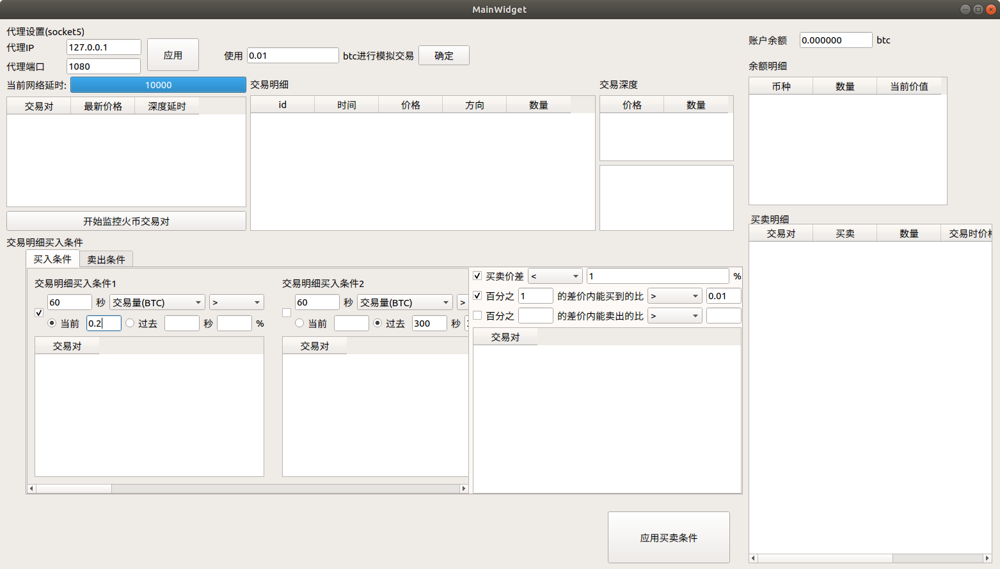

# CoinMarketWatcher

通过监控各种数字货币市场数据的软件
我的联系方式:lihn1011@163.com
## 目前进度
- 能够监控历史交易数据，并在界面上显示
- 能够监控实时价格，并在界面上显示
- 能够非实时监控交易深度，并在界面上显示
- 能够将一段时间交易量作为买入条件
- 能够将一段时间交易量同另外一段时间交易量的比例作为买入条件
- 能够将一段时间交易次数作为买入条件
- 能够将一段时间交一次数同另外一段时间交易次数的比例作为买入条件
- 能够同时设置10个基于交易明细的买入条件
- 能够将一段时间内的买卖交易量比作为买入条件
- 能够将一段时间内的买卖交易量比同另外一段时间的买卖交易量比的比例作为买入条件
- 能够将一段时间的买卖交易次数比作为买入条件
- 能够将一段时间内的买卖交易次数比同另外一段时间的买卖交易次数比作为买入条件
- 能够在界面上进行代理设置
- 能够将买卖价格差作为买入条件
- 能够将百分比内能买到的btc数量作为买入条件
- 能够模拟买入
- 优化短视内存占用
- 增加模拟卖盘，优化短视策略
- 为卖盘增加止赢止损策略
- 能够监控时间内的比特比价格，以及所有监控的价格涨跌进行统筹性体现

## 正在进行的计划
- 能够将数据保存到数据库以备用
- 对连接上火币之后的头几条信息进行判断超时
- 实现对账户的配置

## 未来计划
- 能够对卖出条件进行筛选
- 实现对账户的配置
- 能够模拟卖出
- 实现实盘买入功能
- 实现实盘卖出功能
- 实现对账户的监控
- 实现对交易历史的监控
- 实现对套利历史的分析

## 已知bug
- websocket超时时，无法直接重连，因为头几条消息的延时时间非常长，无法手动进行超时判断，而我又担心加了代理后，有时连接断开无法被发现

##日志
- 2018-12-05 比特币跌3个点，策略相对于比特币亏3个点
- 2018-12-06 22:00 白天只是挂机测试，要上班，修改了下策略，把窗口时间拉长，一白天没什么盈亏,确切的说。。。是微亏。。。晚上增加了对各个持仓盈亏的观察，增加了将数据存到mysql数据库的功能，但是是写死的，没法配置，哈哈
- 2018-12-07 早上看，昨天的测试又崩了，没抓到错误，难道是数据库的事？但是策略上已经进行的买卖基本都赚了3个点，今天白天准备去掉数据库，再次测试下策略
- 2018-12-07日晚上到~2018年12月9日中午，相对于比特币，模拟交易的亏损是1.2个点，还是亏了。。。。中间发生了点问题，有时深度信息会停下来，有时交易信息也会挺个2分钟，这里我需要加些判断快速重启网络才行，另外我想统筹性的观察真个btc为基础的币的行情。
- 2018-12-09 加上了统筹行的一些展示，另外继续把数据库加上那个测试，我就不行抓不到bug！其实，时间有限，没法盯着，还是很难调这个稳定性问题的。。。。
